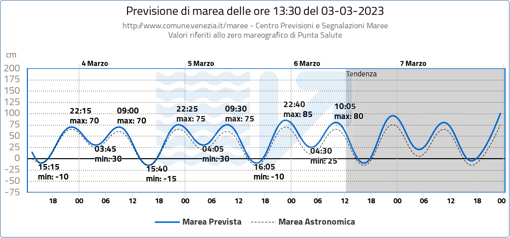
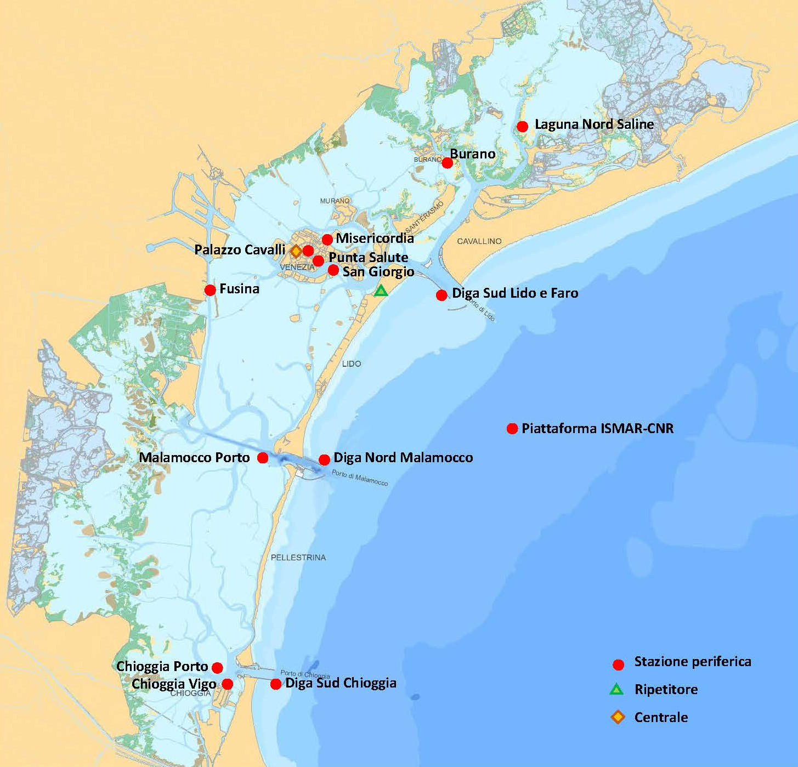

# Venice Meteo Data Cleaning
You are asked to analyze a dataset concerning the **high tides** in Venice. These data are used by the “Centro Previsioni e Segnalazioni Maree” to produce forecasts of the high tide. The current prediction is reported below (in Italian):

## General documentation
The analysis of high tides in Venice has a very long history, and this complex procedure is handled by the [“Centro Previsioni e Segnalazioni Maree”](https://www.comune.venezia.it/it/content/centro-previsioni-e-segnalazioni-maree), located in **Palazzo Cavalli**. Their website contains interesting material you are encouraged to read.

If you are unfamiliar with this phenomenon, you may want to read this short [booklet (ITA and ENG)](https://www.comune.venezia.it/sites/comune.venezia.it/files/documenti/centro_maree/bibliografia/Libretto_2020_senza_copertina.pdf) to get an overview. This [additional booklet (ITA)](https://www.comune.venezia.it/sites/default/files/publicCPSM2/pubblicazioni/Venezia_altimetria_2009.pdf) is also quite informative.

### Dataset description
The data can be [downloaded here (venice_meteo.zip)](https://datasciencebocconi.github.io/Data/venice_meteo.zip) or see the data under the `raw_data` folder of this repository. Inside the folder, you will find several datasets, each corresponding to a different meteorological station, which are:

- Palazzo Cavalli (ITA) (`Stazione_PalazzoCavalli.csv`)
- Burano (ITA) (`Stazione_Burano.csv`)
- ISMAR-CRN platform (ITA) (`Stazione_Piattaforma.csv` and `Stazione_Piattaforma_pg.csv`)
- Isola di San Giorgio (ITA) (`Stazione_SanGiorgio.csv`)
- Misericordia (ITA) (`Stazione_Misericordia.csv`)
- Punta Salute (ITA) (`Stazione_PuntaSalute_CanalGrande.csv`)
- Lido faro (ITA) (`Stazione_DigaSudLido.csv`)

Each station tracks different kinds of information, depending on the sensors that have been installed. A [detailed documentation (ITA)](https://www.comune.venezia.it/node/7498) of these datasets is made available by the Centro Maree for each of the above locations. Please refer to the above link for **the variable description**.

There are also three additional files:

- Meteorological data (`Dati_Meteo.csv`)
- Astronomical tide (`astronomical_tide_2022.json` and `astronomical_tide_2023.json`)

There is a big overlap between the station data and the [meteorological data (ITA and ENG)](https://www.comune.venezia.it/node/5678). The astronomical data are obtained from a mathematical model, as [described here (ITA and ENG)](https://www.comune.venezia.it/it/content/la-marea-astronomica).

### Project Rules
Create a single dataset in which the rows are **hourly observations** ranging from ***November 15th, 2022, to January 31st, 2023***, combining the information that has been made available. At the very least, you should:

- Merge all the above datasets;
Delete the redundant variables and translate their names into English;
- Exclude from the analysis observations not belonging to 2022-11-15 to 2023-01-31;
- Aggregate some variables, so that observations are recorded hourly rather than every 5 minutes. - You will need to think about an appropriate aggregation method for each variable (sum, mean, max, min, and median are possible candidates);
- The final dataset will be exported as `tidy_data.csv`

## Noteable Project Info
### Final Datasets
This project has outputted three datasets after consolidation:
1. `full_consolidated_data`: Full uncompromised data after combining all datasets from `raw_data`
2. `filtered_consolidated_data`: Full data with columns aggregated to hourly intervals and redacted to the target timefram of Nov 2022 to Jan 23. This is similar to `tidy_data`
3. `imputed_consolidated_data`: This is data similar to `filtered_consolidated_data` but with missing values imputed or dropped from the dataset if they could not be imputed. (Ideal for Data Exploration)

### Understanding Final Dataset Column Names
As we consolidate data from stations, we'll use the following format to create simple yet readable column names. Here is how we'll summarise data from the different stations:

| Station | Shortened Name |
|---|---|
| Stazione Burano | `burano` |
| Stazione Diga Sud Lido | `diga` |
| Stazione Misericordia | `miseri` |
| Stazione Palazzo Cavalli | `palazzo` |
| Stazione Piattaforma PG | `pg_piatta` |
| Stazione Piattaforma | `piatta` |
| Stazione Punta Salute (Canale Grande) | `punta` |
| Stazione San Giorgio | `sgiorgio` |

At the same time, we'll rename the column variables as follows:

| Symbol | Parameter | Unit of measurement | Shortened Label |
|---|---|---|---|
| Liv | tide level | meter | `tide_level` |
| DV | average wind direction ( over 10 minutes previous ) | degrees | `wind_direction` |
| VV | average wind speed ( over the previous 10 minutes ) | m / s | `average_wind_speed` |
| VVx | max wind speed ( in the previous 15 minutes ) | m / s | `max_wind_speed` |
| Pr | atmospheric pressure | hPa | `pressure` |
| T air | air temperature | ° C | `temperature` |
| T H2O | water temperature | ° C | `water-temperature` |
| Um | relative humidity | % | `humidity` |
| Pg | precipitation | mm | `precipitation` |
| Rs | solar radiation | W / m2 | `solar` |
| O Hs | significant wave height | meter | `sign_wave_height` |
| Or Hx | maximum wave height | meter | `max_wave_height` |

### Acknowledging Key Resources
I will maintain an active list of resources that helped solve for the hardest bits of data cleaning:
1. Article from Towards Data Science: [How to group data by time intervals in Python Pandas?](https://towardsdatascience.com/how-to-group-data-by-different-time-intervals-using-python-pandas-eb7134f9b9b0)
2. Discussion from StackOverflow: [Filtering Pandas DataFrames on dates](https://stackoverflow.com/questions/22898824/filtering-pandas-dataframes-on-dates)